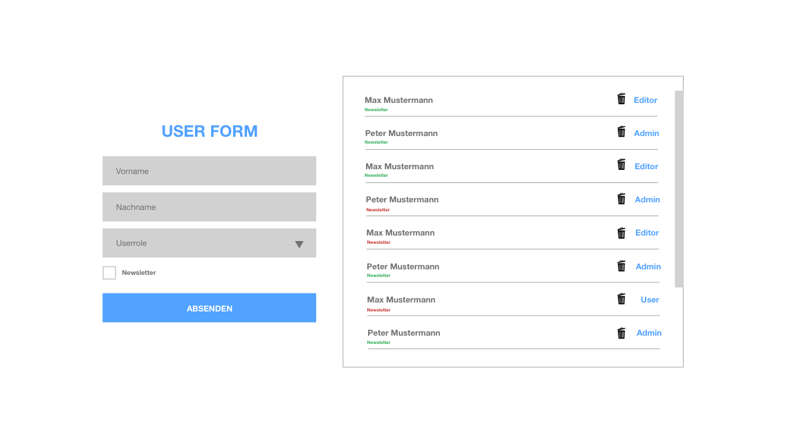

# Userrole Form

Projektaufgabenstellung: Responsive ReactJS-Anwendung mit Tailwind CSS, TypeScript und verschiedenen Funktionen

Ziel des Projekts: Entwickeln Sie eine responsive ReactJS-Anwendung unter Verwendung von Tailwind CSS, TypeScript und verschiedenen Funktionen wie React Hook Form, Validierung mit Yup und die Speicherung der Daten im Local Storage. Die Anwendung soll ein Formular mit Eingabefeldern für Vorname, Nachname und eine Auswahlliste für die Benutzerrolle enthalten. Nach dem Absenden des Formulars sollen die eingegebenen Daten in einer Liste auf der rechten Seite angezeigt und im Local Storage gespeichert werden.

